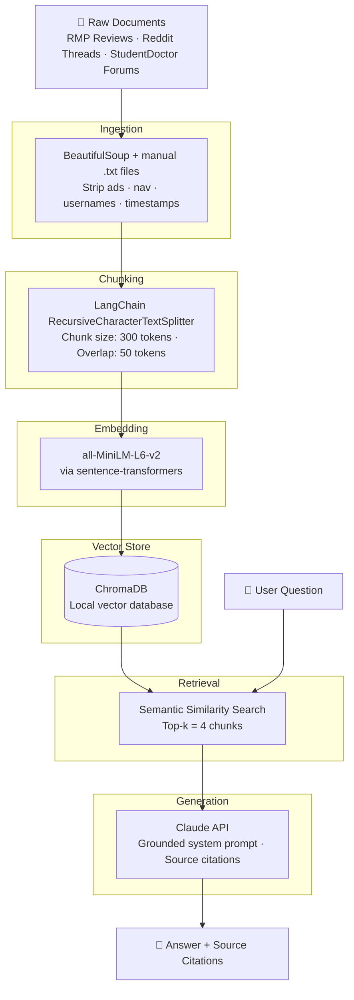

# Project 1 Planning: The Unofficial Guide

> Write this document before you write any pipeline code.
> Your spec and architecture diagram are what you'll use to direct AI tools (Claude, Copilot, etc.) to generate your implementation — the more specific they are, the more useful the generated code will be.
> Update the Retrieval Approach and Chunking Strategy sections if you change your approach during implementation.
> Update this file before starting any stretch features.

---

## Domain

<!-- What domain did you choose? Why is this knowledge valuable and hard to find through official channels? -->
The domain I chose is Student Reviews of Biology Professors and Courses. This system makes student-generated knowledge about biology professors and courses searchable and answerable. Students share this kind of knowledge on Rate My Professors, Reddit, and course-specific forums, but it's scattered across dozens of pages with no way to ask a plain question like "Which bio professor is best for pre-med students?" or "Is BIO 301 worth taking if you struggle with labs?" Official channels like course catalogs and department websites tell you what a course covers, not what it's actually like to take it. 

---

## Documents

<!-- List your specific sources: URLs, subreddit names, forum threads, or file descriptions.
     Aim for at least 10 sources that together cover different subtopics or perspectives within your domain. -->

| # | Source | Description | URL or location |
|---|--------|-------------|-----------------|
| 1 | Rate My Professors | Student reviews of a bio professor (intro bio) | https://www.ratemyprofessors.com/professor/1751109 |
| 2 | Rate My Professors | Student reviews of a bio professor (upper level courses) | https://www.ratemyprofessors.com/professor/889023 |
| 3 | Rate My Professors | Student reviews of a third bio professor | https://www.ratemyprofessors.com/professor/823707 |
| 4 | Reddit r/AdelphiUniversity | Student advice on suitability of Adelphi for premed |https://www.reddit.com/r/AdelphiUniversity/comments/1jsf5li/which_school_should_i_pick/|
| 5 | Reddit r/premed | Student guide for undergrad premed | https://www.reddit.com/r/premed/wiki/coursework/ |
| 6 | Reddit r/premed | Tips for excelling in Bio courses | https://www.reddit.com/r/premed/comments/y0l51b/some_advice_if_you_struggle_with_bio_classes/ |
| 7 | Reddit r/biology | General biology course survival tips | https://www.reddit.com/r/biology/comments/ps6hkz/how_to_study_for_biology/ |
| 8 | StudentDoctor Network | Cell Biology vs. Genetics | https://forums.studentdoctor.net/threads/cell-biology-vs-genetics.1200034/ |
| 9 | Rate My Professors | Student reviews of a bio lab professor | https://www.ratemyprofessors.com/professor/219596 |
| 10 | StudentDoctor Network | Clarity on Biology Course Sequence for Pre-Requisites | https://forums.studentdoctor.net/threads/clarity-on-biology-course-sequence-for-pre-requisites.1468738/ |

---

## Chunking Strategy

<!-- How will you split documents into chunks?
     State your chunk size (in tokens or characters), overlap size, and explain why those
     numbers fit the structure of your documents.
     A review-heavy corpus warrants different chunking than a long FAQ. -->

**Chunk size:** 300 tokens

**Overlap:** 50 tokens

**Reasoning:** 
My corpus is a mix of short-form content (RMP reviews averaging 2-5 sentences) and longer forum posts (Reddit threads, StudentDoctor discussions spanning several paragraphs). A uniform 300-token chunk size was chose for simplicity and consistency across document types - it captures one complete thought or review without splitting it awkwardly, while staying small enough that retreieved chunks remain focused and relevant. 

A more sophisticated approach would use heterogenous chunking: smaller chunks (~150 tokens) for RMP reviews since each review is already a self-contained unit, and larger chunks (~350 tokens) for Reddit and forum posts where ideas build across multiple sentences. This would reduce the risk of merging two different students' opinions into one chunk for short reviews, and preserve more reasoning context for longer posts. This is noted as a potential improvement if retrieval quality is poor during evaluation. 

The 50-token overlap ensures that ideas spanning a chunk boundary aren't lost, this matters especially for forum posts where a recommendation might build across sentences that could otherwise land in separate chunks. 

---

## Retrieval Approach

<!-- Which embedding model are you using (e.g., all-MiniLM-L6-v2 via sentence-transformers)?
     How many chunks will you retrieve per query (top-k)?
     If you were deploying this for real users and cost wasn't a constraint, what tradeoffs
     would you weigh in choosing a different embedding model — context length, multilingual
     support, accuracy on domain-specific text, latency? -->

**Embedding model:** all-MiniLM-L6-v2 (via sentence-transformers)

**Top-k:** 4

**Production tradeoff reflection:** 
all-MiniLM-L6-v2 is a strong choice for this project because it runs locally, is free, and performs well on short English text like reviews and forum posts. In a real production system I'd weigh the following tradeoffs:
- Context length: MiniLM handles up to 256 tokens per input, which fits most reviews but could truncate longer forum posts. A model like text-embedding-3-small (OpenAI) supports longer inputs.
- Accuracy on domain-specific text: General-purpose embeddings may miss biology-specific terminology. A biomedical embedding model (e.g. BioBERT-based) could improve retrieval on technical course content. 
- Multilingual support: Not needed for this corpus, but models like multilingual-e5 would matter for a system serving international students.
- Latency and cost: Local models like MiniLM have zero API cost and low latency. API-based models (OpenAI, Cohere) offer higher accuracy but add cost and network dependency. 

---

## Evaluation Plan

<!-- List your 5 test questions with their expected correct answers.
     Questions should be specific enough that you can judge whether the system's response
     is right or wrong. "What are good dining halls?" is too vague.
     "What do students say about wait times at [dining hall name] during lunch?" is testable. -->

| # | Question | Expected answer |
|---|----------|-----------------|
| 1 | What do students say about the workload in into biology courses? | Reviews mention heavy memorization, frequent quizzes, and cumulative exams |
| 2 | What study strategies do premed students recommend for difficult bio courses? | Active recall, spaced repetition, forming study groups, doing practice problems early |
| 3 | Do students consider Cell Biology or Genetics to be the harder course? | StudentDoctor thread indicates Cell Biology is generally considered harder due to conceptual depth |
| 4 | What do students say about professor availability outside of class in the biology department? | RMP reviews mention office hours responsiveness and email reply times |
| 5 | What biology courses do premed students say are most useful for MCAT preparation? | r/premed sources cite Cell Biology, Genetics, and Biochemistry as highest-yield for MCAT |

---

## Anticipated Challenges

<!-- What could go wrong? Name at least two specific risks with reasoning.
     Consider: noisy or inconsistent documents, missing source attribution, off-topic
     retrieval, chunks that split key information across boundaries. -->

1. Noisy web content: RMP and Reddit pages contain navigation menus, upvite counts, usernames, timestamps, and ads mixed in with the actual review text. If ingestion doesn't clean this out properly, chunks will contain irrelevant text that confuses retrieval - a query about professor grading style could retrieve a chunk that's mostly page navigation boilerplate. 

2. Short reviews splitting poorly: Many RMP reviews are only 2-3 sentences. If a review lands across a chunk boundary, the retrieved chunk may contains half a review about one professor and half about another, making it hard for the LLM to generate a coerent, attributed answer. This is a direct risk to cource citation accuracy. 

---

## Architecture

<!-- Draw a diagram of your pipeline showing the five stages:
     Document Ingestion → Chunking → Embedding + Vector Store → Retrieval → Generation
     Label each stage with the tool or library you're using.
     You can use ASCII art, a Mermaid diagram, or embed a sketch as an image.
     You'll use this diagram as context when prompting AI tools to implement each stage. -->

---

## AI Tool Plan

<!-- For each part of the pipeline below, describe:
     - Which AI tool you plan to use (Claude, Copilot, ChatGPT, etc.)
     - What you'll give it as input (which sections of this planning.md, which requirements)
     - What you expect it to produce
     - How you'll verify the output matches your spec

     "I'll use AI to help me code" is not a plan.
     "I'll give Claude my Chunking Strategy section and ask it to implement chunk_text()
     with my specified chunk size and overlap" is a plan. -->

**Milestone 3 — Ingestion and chunking:**
- Tool: Claude
- Input: 10 source URLs, cleaning requirements and my chunking strateg section
- Expected output: `ingest.py` script that fetches and cleans each source into `/data`, and `chunk.py` using RecursiveCharacterTextSplitter (chunk_size=300, overlap=50) with source filename attached as metadata
- Verification: Read 3 output files to confirm no boilerplate, print 5 chunks to confirm each is coherent and has a source filename attached.

**Milestone 4 — Embedding and retrieval:**
- Tool: Claude
- Input: My Retrieval Approach Section (all-Mini-LM-L6-v2, ChromaDB, top-k=4)
- Expected output: `embed.py` that stores chunks in ChromaDB, and `retrieve.py` that returns top 4 relevant chunks with source metadata for any query
- Verification: Run all 5 evaluation questions through `retrieve.py` and confirm returned chunks are actually relevant to each question.

**Milestone 5 — Generation and interface:**
- Tool: Claude
- Input: Generation requirements (Claude API, grounded prompt, citations required) and `retrieve.py` output
- Expected output: `query.py` that retrieves chunks, calls Claude API, and returns a cited answer, plus a simple CLI or web interface
- Verification: Run all 5 evaluation questions end-to-end and confirm every answer includes source citations and no information outside the retrieved chunks
